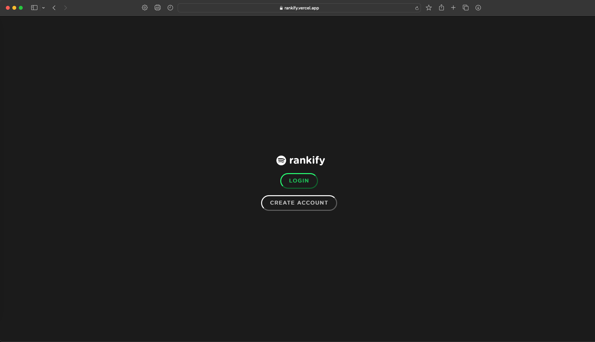
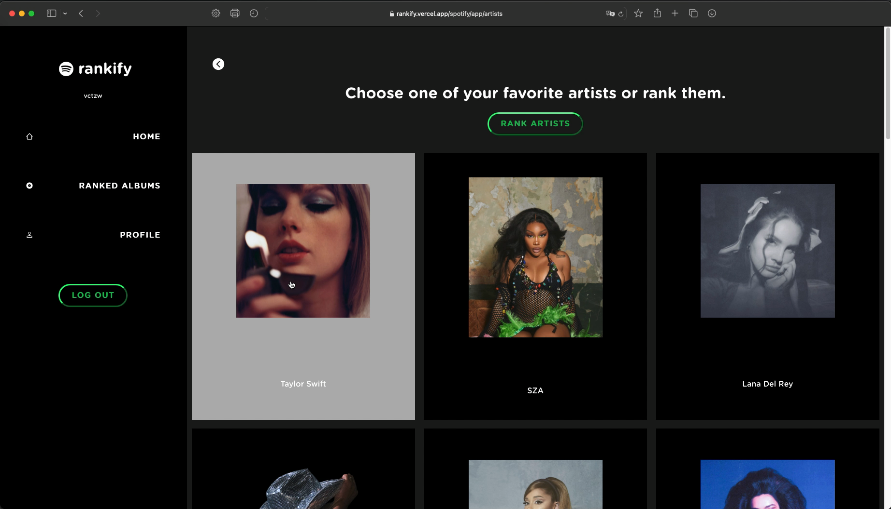
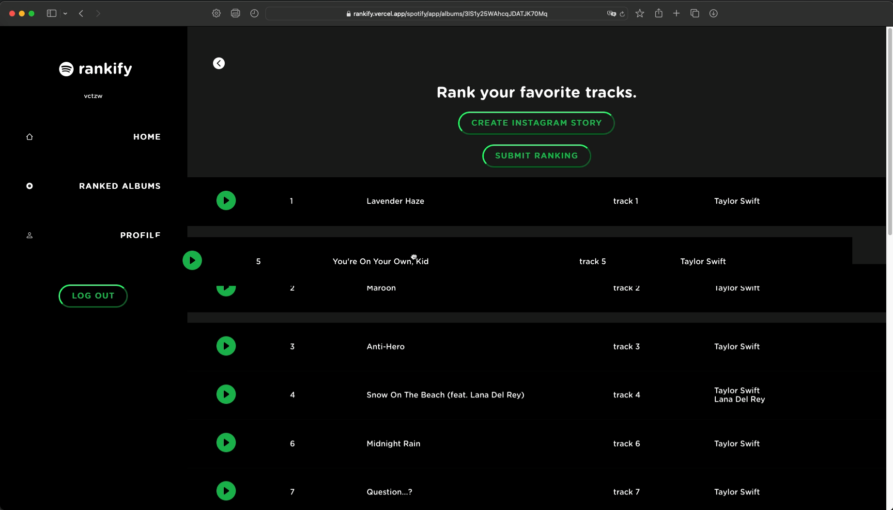
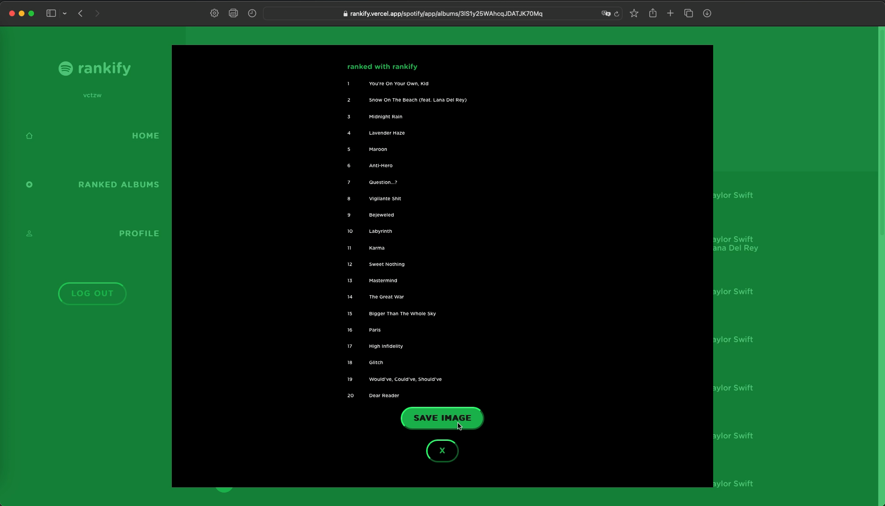
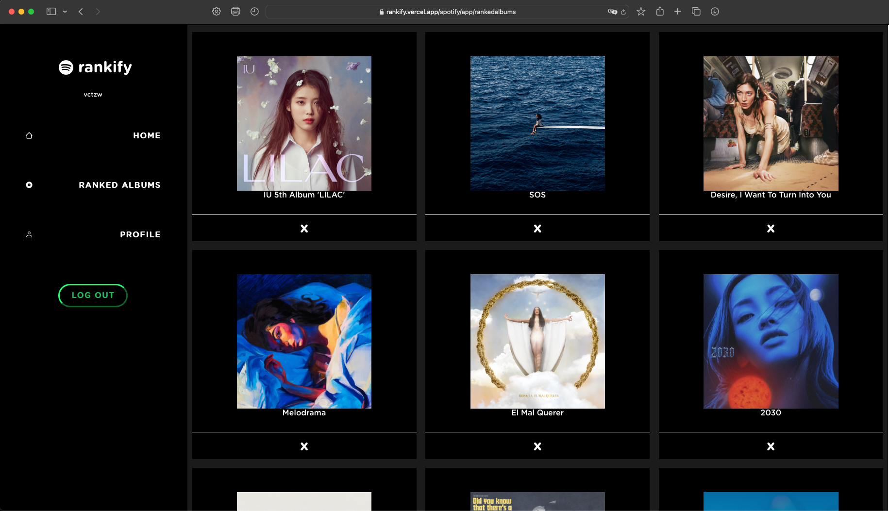

  

## 1. Overview

A React app that allows users to rank their favorite Spotify artists, albums, and tracks, enhancing their music curation experience. Features interactive and visually appealing UI features, such as drag and drop elements, to provide responsive user feedback and create a visually captivating layout.

Users can generate shareable Instagram stories of their favorite tracks and CRUD operations are enabled for storing user rankings.

You can find the production link of the app [here](https://rankify.vercel.app). (Currently waiting for approval from Spotify for quota extension request, so at the moment only authorized users can login).

## 2. Technologies

This reaction was developed using React, Node, Express, and Prisma. The production deployment uses Auth0 for user authentication, PlanetScale for database deployment, Google Cloud for Web API deployment, and Vercel for web hosting.

## 3. Screenshots

## 4. Installation
Clone and install dependencies:

    git clone https://github.com/victorzwu/rankify.git
    cd api
    npm install
    cd ..
    cd client
    npm install

You will need to get a Spotify Developer key as well as integrate Auth0 into your application and put the keys within the .env file. In the API side, you should put your Auth0 keys and MySQL database url within an .env file.
